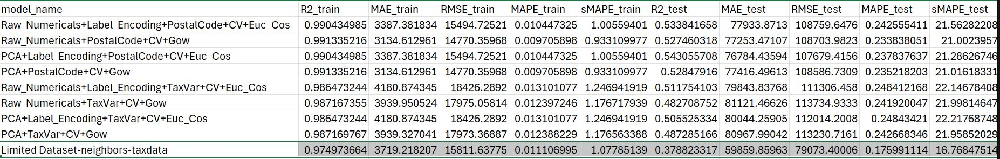
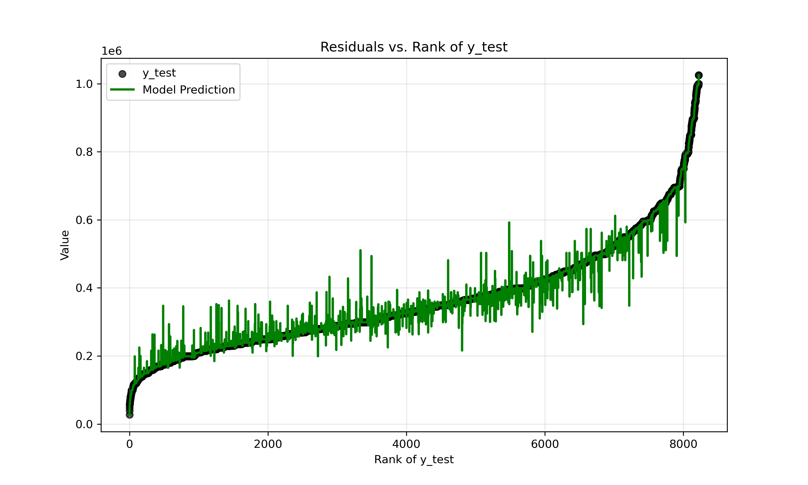

# Evaluation for the selected model

## 1. Code snippet of model instantiation

```python
# Set up preprocessor, load data and add tax data
dataset_2 = DataPreprocessor()
dataset_2.load_data('./Data/Clean_data.csv')
dataset_2.add_mean_income()

# subset data on price range 200,000 - 600,000 to limit overfitting issue
dataset_2.data_income = dataset_2.data_income[(dataset_2.data_income['Price'] >= 200000) & (dataset_2.data_income['Price'] <= 600000)]

# Prepare X and y datasets
dataset_2.get_modelling_X(
    columns=[
        "Mean_income_taxunit",
        "Subtype of property",
        "State of the building",
        "Surface area of the plot of land",
        "Number of rooms",
        "Living Area",
        "Number of facades",
    ]
)
dataset_2.get_modelling_y()

## Calculate Gower distance and split in training-testing data
dataset_2.calc_gower_dist()
dataset_2.gower_train_test()

## Save training data indices
training_indices = dataset_2.train_indices

with open("./Results-Graphs/training_indices.pkl", "wb") as f:
    pickle.dump(training_indices, f)

# Prepare modeller, get model parameters based on input, create model and evaluate using evaluator
Gower_CV_model = Modeller()
Gower_CV_model.set_parameters(CV= False, k= 19, weight='distance', distance="Gower")
Gower_CV_model.get_model(dataset_2.X_train, dataset_2.y_train)

Gower_CV_model_eval = Evaluator(model= Gower_CV_model.model,
                                X_train= dataset_2.X_train,
                                 X_test= dataset_2.X_test,
                                 y_train = dataset_2.y_train,
                                 y_test= dataset_2.y_test)
Gower_CV_model_eval.model_metrics('Raw_Numericals+PostalCode+CV+Gow')

## Save best model in pickle file
with open("./Results-Graphs/best_knn_model_reduced.pkl", "wb") as f:
    pickle.dump(Gower_CV_model.model, f)
```

## 2. Model metrics



## 3. Used features

The features used to predict price include the following:
- Mean taxable income per unit per locality (obj) : Data used to replace raw postal code, doesn't substantially improve model, but reduces possible further issues with extrapolation
- Subtype of property (obj) : categorical, categories as defined on ImmoWeb
- State of the building (obj) : categorical, categories as defined on ImmoWeb
- 'Surface area of the plot of land', 'Number of rooms', 'Living Area', 'Number of facades' (float and int) : raw data from ImmoWeb, numerical data was not scaled since a Gower distance matrix was used in final modelling. Gower distance calculates distances feature by feature, therefore eliminating issues with scaling.

## 4. Accuracy computing 

- Splitting data in 0.8 - 0.2 training - test sets
- Using 5 fold CV gridsearch for hyperparameter tuning

## 5. Efficiency

Not evaluated due to time constraints

## 6. Dataset

The final dataset includes 8260 observations drawn from ImmoWeb. 
In addition, tax/income data was added to replace postal code in the final dataset.

## 7. Feature importance - SHAP

Not added due to time constraints

## 8. Remarks

### General

From the research, modelling and selection, following remarks can be made:
- The best model was chosen based on $R^2$, MAE (most interesting for final estimation use of the model) and RMSE

### Data

- A larger dataset may lead to improved model performance
- The dataset is extremely heterogeneous, including 68.7% apartments and only 31.3% houses. In addition, many categories of subtype of property, amongst other features, include very small groups leading to group imbalance. Improving data selection to train the model may resolve these issues, leading to a more accurate model
- Using PCA to decorrelate variables does not seem to strongly affect the model ; the choice was made to use the raw data to allow beter explanation of the variables included
- The postal code does not seem an ideal predictor variable at first glance, however replacing it by tax/income data seems to lead to a slightly less reliable model. In deployment, if a user should enter a postalcode unknown to the model this will lead to issues, especially if the postal code is an important predictor (SHAP should be carried out).

### Model

- KNN regression does not seem highy adapted to price prediction in this case
- Distance metrics degrade with increasing number of predictors (also leading to the choice of using label encoding rather than one hot encoding), resulting in dilution of 'real' distances between observations, hampering accurate price prediction
- Using Gower distance appears to slightly improve the model in some cases
- Substantial overfitting of the model was detected (Graph 1) even though CV was already used to minimize this
- A systematic bias was observed (Graph 1), where the model often over- or underestimates predicted prices for which the actual value is under or over the average price respectively (see graph). This is taken to be a result of how KNN regression works. Averaging the price over K (19) nearest neighbours would return a value more similar to the general mean price.



Graph 1: Actual (black dot ; training dataset, full price range) and predicted (green line ; training dataset, full price range) prices, ordered by increasing actual price. The x axis represents the observation rank. The sigmoid form of the curve indicates few extreme values at the low and high price values. Predictions closely follow these extreme values, indicating overfitting. A systematic bias, where prices under the mean value are often overestimated, and prices over the mean are most often underestimated is visible


